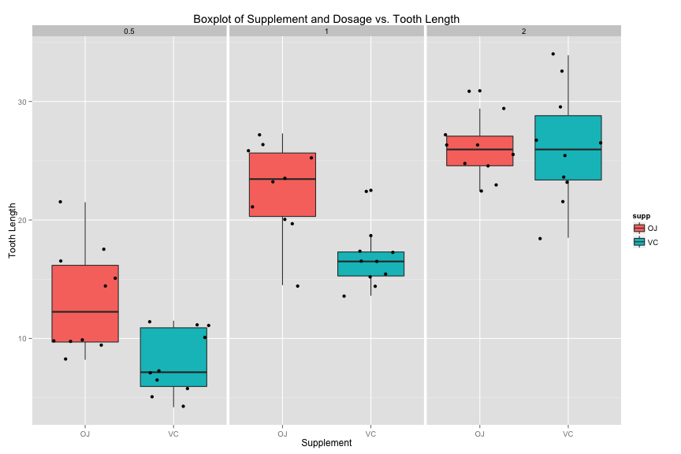

<style>
.footer {
    color: black; 
    background: #E8E8E8;
    position: relative; 
    top: 90%;
    text-align:center; 
    width:80%;
    margin-left: auto;
    margin-right: auto;
}

.small-code pre code {
  font-size: 1em;
}
</style>

<div class="footer" style="font-family:Georgia;font-size:80%;align:center">Matt Narrell, Coursera: Developing Data Products.  June 2015</div>

Vitamin C Impact on Tooth Growth
========================================================
author: Matt Narrell
date: 06/17/2015
font-family: "Georgia"
transition: concave

</img>

The ToothGrowth Dataset
========================================================
The response is the length of odontoblasts (teeth) in each of 10 guinea pigs at each of three dose levels of Vitamin C (0.5, 1, and 2 mg) with each of two delivery methods (orange juice or ascorbic acid).

### References
McNeil, D. R. (1977) Interactive Data Analysis. New York: Wiley.

Dataset Exploration
========================================================
class: small-code

```r
str(ToothGrowth)
```

```
'data.frame':	60 obs. of  3 variables:
 $ len : num  4.2 11.5 7.3 5.8 6.4 10 11.2 11.2 5.2 7 ...
 $ supp: Factor w/ 2 levels "OJ","VC": 2 2 2 2 2 2 2 2 2 2 ...
 $ dose: num  0.5 0.5 0.5 0.5 0.5 0.5 0.5 0.5 0.5 0.5 ...
```

```r
unique(ToothGrowth$dose)
```

```
[1] 0.5 1.0 2.0
```

```r
unique(ToothGrowth$supp)
```

```
[1] VC OJ
Levels: OJ VC
```

Growth as a function of dosage
========================================================

 
The ToothGrowth Application
========================================================
This interactive application, <a href="https://mnarrell.shinyapps.io/ddp_course_project" target="_blank">available here</a>, lets the user investigate the relationships between the type of vitamin C supplement and the dosage levels to illustrate how dosage levels have the greatest impact on overall tooth growth, with orange juice performing slightly better at the very low dosages.

This interactive application allows the user to examine a box plot for a given dosage and supplement, and compare that plot to other combinations.
